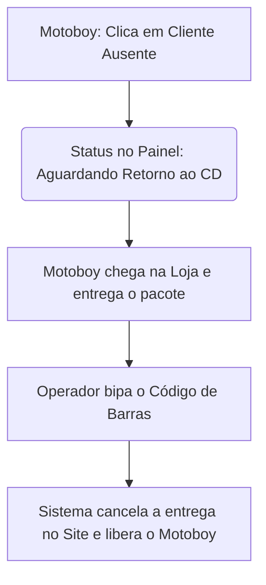
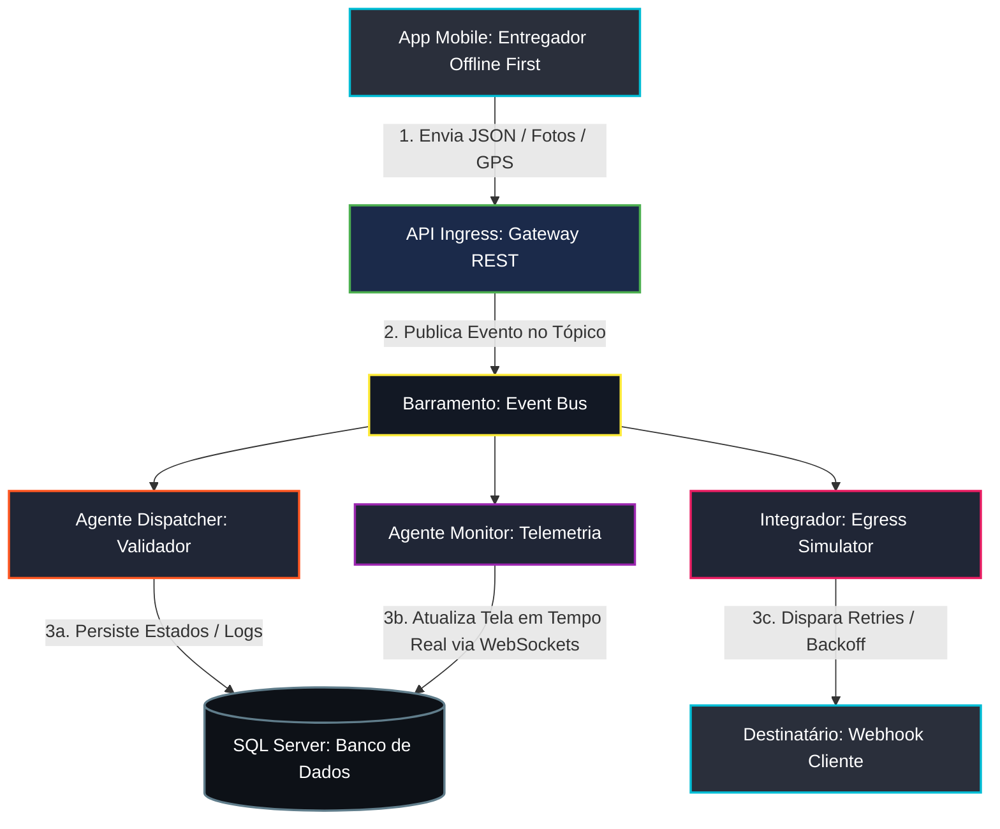

# Distre - Gestão de Entregas

Este projeto simula um ecossistema completo de rastreamento e orquestração de entregas de alto padrão operacional (padrão iFood, Loggi, Rappi), baseado em uma **Arquitetura Orientada a Eventos (EDA - Event-Driven Architecture)** e processamento em segundo plano orientado a **Agentes Inteligentes**.

O sistema é composto por um **Backend em Node.js com TypeScript** que persiste os dados localmente em um banco de dados **SQL Server Express**, e um **Frontend em React com TypeScript** que renderiza o barramento de eventos, mapas de telemetria e o simulador do aplicativo mobile do entregador.

---

## Detalhamento dos Processos Operacionais

### 1. Ciclo de Vida da Comanda (Estados Estritos)
Toda entrega (`pedido`) segue uma jornada de estados imutável e validada no barramento de eventos:
- **RECEBIDO**: Ingestão da entrega no sistema pelo operador (Gateway Ingress).
- **DESPACHADO**: Motorista da frota é localizado e vinculado, com geração automática da rota.
- **EM_TRANSITO**: Rota iniciada e telemetria GPS sendo transmitida em tempo real.
- **NO_LOCAL**: O entregador chega às coordenadas geográficas do destino.
- **ENTREGUE**: Sucesso na entrega (comprovado digital e fisicamente).
- **AGUARDANDO_RETORNO_CD**: Insucesso operacional. A mercadoria fica sob custódia temporária do motorista in trânsito de retorno.
- **PRODUTO_RETORNADO_ESTOQUE**: O conferente física bipa o item no Centro de Distribuição Central, finalizando o fluxo reverso.

---

### 2. Validação Geofencing e Critérios de Conclusão (POD)
Para mitigar fraudes e auditar entregas, a confirmação exige comprovação eletrônica de entrega (Proof of Delivery - POD):
- **Cerca Virtual (Geofencing)**: O botão "Confirmar Entrega" no simulador mobile é bloqueado se a coordenada GPS atual do motorista estiver a uma distância superior a ~100 metros (3 unidades na grade) do destino planejado.
- **Liberação por Justificativa**: Se o GPS falhar ou divergir, o entregador deve marcar a caixa de exceção e descrever textualmente a justificativa (ex: "Sem precisão no sinal GPS"), gerando um alerta visual no painel do operador.
- **Validação de POD Físico**: O entregador precisa obrigatoriamente fornecer:
  1. Nome por extenso do recebedor.
  2. CPF válido do recebedor.
  3. Foto anexada (Canhoto assinado, fachada ou portaria).
  4. Assinatura/rubrica digital.

---

### 3. Sincronização Estrita e Modo Offline (Edge Outbox Sync)
Em cenários de baixa conectividade, o aplicativo móvel armazena as interações localmente para sincronização futura:
- **Fila Outbox Local**: Ações de confirmação/falha de entrega realizadas offline são enfileiradas no `localStorage` do navegador.
- **Buffer de Telemetria**: Coordenadas GPS geradas durante a ociosidade da rede são acumuladas sequencialmente.
- **Flush em Lote**: Ao restabelecer a conexão (desmarcando a caixa "Offline"), o outbox dispara um envio em massa (bulk) da telemetria acumulada para remontar o mapa retrospectivo, seguido da sincronização do status final.

---

### 4. Gestão de Exceções Logísticas (Módulo 3)

#### A. Quebra de Sequência (Desvio de Rota)
- O sistema permite atribuir até **3 comandas simultâneas** para o mesmo entregador.
- O Dispatcher calcula a ordem de sequência lógica com base na proximidade espacial (`SEQUENCIA_ESPERADA`).
- Se o entregador entregar uma comanda subsequente sem ter finalizado a anterior, o barramento propaga o evento `AlertaDesvioSequencia` e a comanda pulada recebe um marcador visual piscante amarelo **"ROTA PULADA"** no mapa e nos painéis.

#### B. Ociosidade e Parada Não Programada (Stale Driver)
- Se um motorista permanecer parado no mesmo local por mais de **10 segundos** na simulação (equivalente a 15 minutos em ambiente real) com entregas ativas `EM_TRANSITO`, o sistema gera o alerta `AlertaParadaProlongada`.
- O ícone do veículo afetado começa a **piscar em vermelho em alta frequência** no mapa do painel para chamar a atenção do supervisor.

#### C. Rollback de Ações (Estorno de Status)
- Caso o entregador clique acidentalmente no botão de confirmar ou falhar, o simulador mobile exibe um botão para desfazer a ação.
- A **janela de tolerância é de 60 segundos** e exige que o entregador ainda esteja dentro da área de Geofencing. Ao acionar, a entrega volta para `NO_LOCAL` e o motorista retorna para o status `ocupado`.

#### D. Matriz de Motivos de Insucesso
Para evitar registros arbitrários, o insucesso exige a seleção de um código padronizado com comportamento de contingência associado:
- **01 - Cliente Ausente (3 tentativas de contato)**: Encaminha custódia reversa temporária.
- **02 - Endereço Não Localizado / Incompleto**: Abre incidente para retificação cadastral.
- **03 - Estabelecimento Fechado (Comercial)**: Aloca prioridade para reagendamento.
- **04 - Recusa por Avaria ou Item Incorreto**: Dispara aviso prioritário de reenvio no estoque.
- **05 - Falta de Segurança no Local (Área de Risco)**: Interrompe a rota imediatamente.

---

### 4.2. Fluxo Enxuto de Insucesso e Cancelamento (Módulo 3.2)

#### A. No Aplicativo Mobile: O Disparo do Insucesso
Quando o motoboy chega ao endereço e o cliente não atende (após tentativas de contato):
1. **Ação do Motoboy**: No app, ele seleciona a comanda e clica em **"Cliente Ausente / Devolver Pedido"**.
2. **Mudança Automática de Status**: A entrega assume instantaneamente o status **AGUARDANDO RETORNO AO CD** (ou À Loja/Restaurante).
3. **Trava de Segurança**: O app mantém essa comanda visível na tela do motoboy para indicar que ele possui um produto físico que precisa ser devolvido ao balcão.

#### B. No Painel Web: O Recebimento e Cancelamento Automático
Assim que o motoboy bota o pé de volta na farmácia ou no restaurante:
1. **O Bipe de Retorno**: O operador do caixa/despacho clica no botão verde **"Bipar Código de Barras (Retorno ao Estoque)"** e lê a comanda física que voltou com o motoboy.
2. **Ação Automática do Sistema (O Cancelamento)**: Ao processar esse bipe, o sistema executa três ações automáticas em segundo plano:
   - **Finaliza a Entrega**: O status da comanda muda para CANCELADO / DEVOLVIDO (PRODUTO_RETORNADO_ESTOQUE).
   - **Libera o Motoboy**: O motoboy (Ex: Bob - Moto-02) é limpo daquela pendência na hora e seu status volta para **Disponível** para puxar a próxima entrega.
   - **Integração de Cancelamento (Vendas)**: O site/sistema de vendas recebe o evento `delivery.canceled` para estornar o pagamento (se for cartão/Pix online) ou para que o atendente saiba que aquele pedido foi abortado na rua.

#### C. Fluxograma do Processo Simplificado


---


### 5. Motor de Eventos do Monitor e Notificações (Egress) (Módulo 4)

#### A. Processamento do Agente Monitor
O Agente Monitor atua de forma proativa processando eventos em tempo real transmitidos pelo barramento de mensagens para atualizar métricas e painéis sem sobrecarregar a base de dados relacional:
- **GPS_HEARTBEAT**: Transmite as coordenadas geográficas em tempo real do motoboy para atualização do componente de telemetria visual.
- **COMANDA_ENTREGUE**: Atualiza de forma otimista a fila de entregas pendentes vinculadas ao motorista, incrementando o contador agregado de sucesso e removendo o marcador de geolocalização no mapa.
- **ALERTA_GERADO**: Altera o estado do card do Agente Monitor na topologia para "Atenção" (status warning) ou "Crítico" (status critical), dependendo da gravidade informada pelo incidente, registrando a mensagem na linha do tempo.

#### B. Cálculo de ETA Dinâmico e Alerta Precoce
A cada 3 batimentos consecutivos de telemetria (GPS_HEARTBEAT), o monitor recalcula a distância Euclidiana linear até o destino da próxima comanda pendente na sequência lógica do entregador.
Se a velocidade do veículo cair abaixo de 30% da velocidade nominal planejada para o seu tipo de veículo (indicando tráfego pesado ou retenção severa), o monitor altera imediatamente o status da entrega para SLA_ALERTA. Esse comportamento antecipa gargalos logísticos antes de se tornarem atrasos reais consolidados.

#### C. Políticas de Retentativas e Dead Letter Queue (DLQ)
A comunicação com sistemas terceiros (ERP, CRM) via webhooks (Egress Simulator) utiliza uma política estrita de retentativas assíncronas com Exponential Backoff para tolerar falhas de infraestrutura externa:
1. **Tentativa 1**: Disparo imediato logo após a conclusão da entrega.
2. **Tentativa 2**: Executada após 5 segundos em caso de falha inicial.
3. **Tentativa 3**: Executada após 25 segundos se o erro persistir.
4. **Tentativa 4**: Executada após 120 segundos (2 minutos).
5. **Tentativa 5**: O webhook é rotulado permanentemente como "Falhado" na interface para fins de auditoria, e o payload correspondente é encaminhado para a Dead Letter Queue (DLQ), cessando novas chamadas.

#### D. Payload de Integração Padronizado
O payload despachado nas notificações do Integrador de saída segue uma estrutura corporativa fixa:
```json
{
  "event_id": "EVT_883921_XYZ",
  "event_type": "delivery.completed",
  "timestamp": "2026-05-26T14:15:00-03:00",
  "data": {
    "comanda_id": "del-E209",
    "cliente": "Lojas Americanas",
    "entregador": {
      "id": "drv-02",
      "nome": "Bob (Moto-02)"
    },
    "conclusao": {
      "coordenadas_entrega": {
        "lat": -23.55052,
        "lng": -46.63330
      },
      "recebedor_nome": "Marcos Oliveira",
      "recebedor_documento": "123.456.789-00",
      "assinatura_url": "https://storage.sistema.com/signatures/del-E209.png",
      "foto_fachada_url": "https://storage.sistema.com/photos/del-E209.jpg"
    }
  }
}
```

---

## API Pública de Integração — Ingestão de Pedidos

Endpoint dedicado para que sistemas externos (e-commerce, PDV, marketplaces, bots) enviem pedidos diretamente para a fila de comandas da loja. O pedido entra no ciclo de vida normal (`RECEBIDO` → ...) e é propagado em tempo real para o painel via WebSocket.

### `POST /api/integracao/pedidos`

**Autenticação:** header `X-Loja-Id: <uuid-da-loja>` (ou campo `lojaId` no body). A loja precisa estar cadastrada no sistema multi-tenant.

**Headers**
```
Content-Type: application/json
X-Loja-Id: 41869dbf-4b09-4933-8bd2-11e60ccc092d
```

**Payload**
```json
{
  "cliente": {
    "nome": "João da Silva",
    "telefone": "+5511999998888",
    "documento": "123.456.789-00"
  },
  "produtos": [
    { "nome": "X-Burguer", "quantidade": 2, "precoUnitario": 25.00 },
    { "nome": "Refrigerante 350ml", "quantidade": 1, "precoUnitario": 7.00, "observacao": "Bem gelado" }
  ],
  "valores": {
    "subtotal": 57.00,
    "taxaEntrega": 8.00,
    "desconto": 0,
    "total": 65.00
  },
  "endereco": {
    "logradouro": "Rua das Flores",
    "numero": "123",
    "complemento": "Apto 42",
    "bairro": "Centro",
    "cidade": "São Paulo",
    "uf": "SP",
    "cep": "01000-000",
    "referencia": "Próximo à padaria"
  },
  "pagamento": { "forma": "pix", "troco": 0 },
  "prioridade": "media",
  "tipoCarga": "normal",
  "observacao": "Entregar após 19h",
  "idPedidoExterno": "EXT-1234"
}
```

**Campos obrigatórios**
- `cliente.nome`
- `produtos[]` com pelo menos 1 item, cada um contendo `nome` e `quantidade > 0`
- `endereco.logradouro`

**Campos opcionais / com default**
- `valores.subtotal` e `valores.total` são calculados automaticamente a partir de `precoUnitario × quantidade` quando ausentes.
- `pagamento.forma` aceita `pix | dinheiro | maquininha | credito | debito | cartao | cartao_credito | cartao_debito` (mapeado internamente para o enum `FormaPagamento` — variantes de cartão viram `maquininha`).
- `prioridade`: `baixa | media | alta | critica` (default `media`).
- `tipoCarga`: `normal | expressa | agendado` (default `normal`).

**Comportamento**
- Se a loja tem `recebePedidos = true`, a comanda é criada como `tipoComanda: 'pedido'` (fluxo de preparo: `RECEBIDO` → `EM_PREPARO` → finalização gera comanda de entrega).
- Caso contrário, entra como `tipoComanda: 'entrega'` e é publicada no broker no tópico `entrega.recebida`, acionando o Agente Dispatcher.

**Resposta `201 Created`**
```json
{
  "success": true,
  "pedidoId": "COMANDA-0042",
  "status": "RECEBIDO",
  "tipoComanda": "pedido",
  "total": 65,
  "subtotal": 57,
  "taxaEntrega": 8,
  "desconto": 0
}
```

**Erros**
- `400` — header `X-Loja-Id` ausente, payload inválido ou campos obrigatórios faltando.
- `404` — `lojaId` informado não existe.
- `500` — falha interna ao persistir no SQL Server.

**Exemplo `curl`**
```bash
curl -X POST http://localhost:5000/api/integracao/pedidos \
  -H "Content-Type: application/json" \
  -H "X-Loja-Id: 41869dbf-4b09-4933-8bd2-11e60ccc092d" \
  -d '{
    "cliente": { "nome": "João da Silva", "telefone": "+5511999998888" },
    "produtos": [{ "nome": "X-Burguer", "quantidade": 2, "precoUnitario": 25.00 }],
    "endereco": { "logradouro": "Rua das Flores, 123", "bairro": "Centro", "cidade": "São Paulo" },
    "pagamento": { "forma": "pix" }
  }'
```

### `POST /api/integracao/entregas`

Endpoint específico para **ERPs externos** despacharem comandas de **entrega já prontas** — a venda foi concluída no ERP, o produto está separado/faturado e só precisa ser entregue. Diferente de `/pedidos`, esta rota **ignora o flag `recebePedidos`** da loja: a comanda é sempre criada como `tipoComanda: 'entrega'` e publicada imediatamente no broker no tópico `entrega.recebida`, acionando o Agente Dispatcher para alocar um motoboy.

**Quando usar cada endpoint:**
| Cenário | Endpoint | tipoComanda | Fluxo |
|---|---|---|---|
| Pedido novo (precisa preparo: cozinha, separação, etc.) | `/api/integracao/pedidos` | `pedido` ou `entrega` (depende de `recebePedidos`) | `RECEBIDO` → `EM_PREPARO` → finalização cria entrega |
| Venda já fechada no ERP, produto pronto para sair | `/api/integracao/entregas` | sempre `entrega` | `RECEBIDO` → despacho automático |

**Autenticação:** idêntica à `/pedidos` — header `X-Loja-Id: <uuid-da-loja>`.

**Payload** (mesmo esquema de `/pedidos`, com dois campos adicionais opcionais):
```json
{
  "cliente": {
    "nome": "Maria Souza",
    "telefone": "+5511988887777",
    "documento": "987.654.321-00"
  },
  "produtos": [
    { "nome": "Notebook Dell Inspiron 15", "quantidade": 1, "precoUnitario": 4299.00 },
    { "nome": "Mouse sem fio", "quantidade": 1, "precoUnitario": 89.90 }
  ],
  "valores": {
    "subtotal": 4388.90,
    "taxaEntrega": 0,
    "desconto": 0,
    "total": 4388.90
  },
  "endereco": {
    "logradouro": "Av. Paulista",
    "numero": "1578",
    "complemento": "Sala 1203",
    "bairro": "Bela Vista",
    "cidade": "São Paulo",
    "uf": "SP",
    "cep": "01310-200",
    "referencia": "Edifício comercial, recepção até 18h"
  },
  "pagamento": { "forma": "credito" },
  "prioridade": "alta",
  "tipoCarga": "expressa",
  "observacao": "Mercadoria frágil — manusear com cuidado",
  "numeroPedidoErp": "NF-2026-00031245",
  "origemErp": "TOTVS Protheus",
  "idPedidoExterno": "OS-87231"
}
```

**Campos adicionais (em relação a `/pedidos`)**
- `numeroPedidoErp` (opcional): número do pedido/NF no sistema ERP de origem.
- `origemErp` (opcional): identificação do ERP que originou a entrega (TOTVS, SAP, Bling, Tiny, etc.).

Esses dois campos são concatenados em `referencia` da comanda para rastreabilidade e aparecem no painel/comprovante.

**Resposta `201 Created`**
```json
{
  "success": true,
  "entregaId": "COMANDA-0043",
  "status": "RECEBIDO",
  "tipoComanda": "entrega",
  "total": 4388.90,
  "subtotal": 4388.90,
  "taxaEntrega": 0,
  "desconto": 0
}
```

**Erros:** mesmos códigos de `/pedidos` (`400`, `404`, `500`).

**Exemplo `curl`**
```bash
curl -X POST http://localhost:5000/api/integracao/entregas \
  -H "Content-Type: application/json" \
  -H "X-Loja-Id: 41869dbf-4b09-4933-8bd2-11e60ccc092d" \
  -d '{
    "cliente": { "nome": "Maria Souza", "documento": "987.654.321-00" },
    "produtos": [{ "nome": "Notebook Dell", "quantidade": 1, "precoUnitario": 4299.00 }],
    "endereco": { "logradouro": "Av. Paulista, 1578", "bairro": "Bela Vista", "cidade": "São Paulo" },
    "pagamento": { "forma": "credito" },
    "prioridade": "alta",
    "tipoCarga": "expressa",
    "numeroPedidoErp": "NF-2026-00031245",
    "origemErp": "TOTVS Protheus"
  }'
```

---

## Estrutura do Banco de Dados SQL Server

A persistência do sistema está conectada ao banco de dados local **`GESTAO_DADOS`** (servidor `localhost\SQLEXPRESS`) via Autenticação Integrada do Windows (`msnodesqlv8`).

### Tabela: `ENTREGAS`
Armazena a entidade e o histórico do ciclo de vida dos pedidos.
- `ID`: Chave Primária (ex: `del-A1B2C3D`).
- `NOME_CLIENTE`: Nome do destinatário.
- `ENDERECO`: Endereço completo.
- `ITENS`: Lista de produtos JSON stringificada.
- `PRIORIDADE`: Nível de SLA.
- `TIPO_CARGA`: padrão, cadeia_fria, expresso, fragile.
- `STATUS`: Estado operacional atual.
- `MOTORISTA`: Dados estruturados do entregador.
- `ROTA`: Coordenadas e custos do percurso planejado.
- `TELEMETRIA`: Velocidade, posição GPS e temperatura atual da carga fria.
- `INCIDENTES`: Array contendo panes ou alertas registrados na entrega.
- `URL_WEBHOOK` e `LOGS_WEBHOOK`: Registros de integrações acionadas.
- `CRIADO_EM` / `ATUALIZADO_EM`: Dates de registro e alteração.
- `RECEBEDOR_NOME` / `RECEBEDOR_CPF`: Dados POD de confirmação.
- `COMPROVANTE_FOTO_URL` / `ASSINATURA_BASE64`: Canhoto de assinatura e anexo POD.
- `JUSTIFICATIVA_DESVIO_COORDENADA`: Justificativa em caso de geofencing override.
- `DATA_HORA_CONCLUSAO`: Timestamp de fechamento (usado no controle de rollback).
- `SEQUENCIA_ESPERADA` / `SEQUENCIA_REALIZADA`: Dados de auditoria de sequência de rota.

### Tabela: `LOGS_EVENTOS`
Registra a telemetria integral de mensagens trafegadas pelo Hub Broker do barramento.
- `ID`: Chave Primária UUID.
- `TOPICO`: Nome do tópico do evento (ex: `entrega.recebida`, `entrega.monitorada`).
- `ENTREGA_ID`: ID do pedido relacionado.
- `CONTEUDO`: Payload do evento serializado em JSON.
- `TIMESTAMP_REGISTRO`: Data/Hora exata de gravação do log.


---

## Módulo 5: Desenho Arquitetural e Fluxo de Dados (Event-Driven)

Este documento apresenta os diagramas visuais do ecossistema, mapeando a jornada da informação desde a rua até a atualização do painel e disparo de webhooks.

### 1. Diagrama de Arquitetura Geral do Sistema

Este diagrama ilustra como os componentes visuais da tela (Frontend) se conectam com a infraestrutura e os microsserviços por trás dos panos.



---


## Como Executar o Projeto

1. Certifique-se de possuir o **SQL Server Express** local rodando com o banco `GESTAO_DADOS` criado.
2. Na raiz do projeto, instale as dependências:
   ```bash
   npm run install-all
   ```
3. Inicie o ecossistema frontend e backend simultaneamente em modo dev:
   ```bash
   npm run dev
   ```
4. Acesse o frontend no navegador em: http://localhost:5173/
5. Monitore os logs no terminal para acompanhar o ciclo dos agentes.
