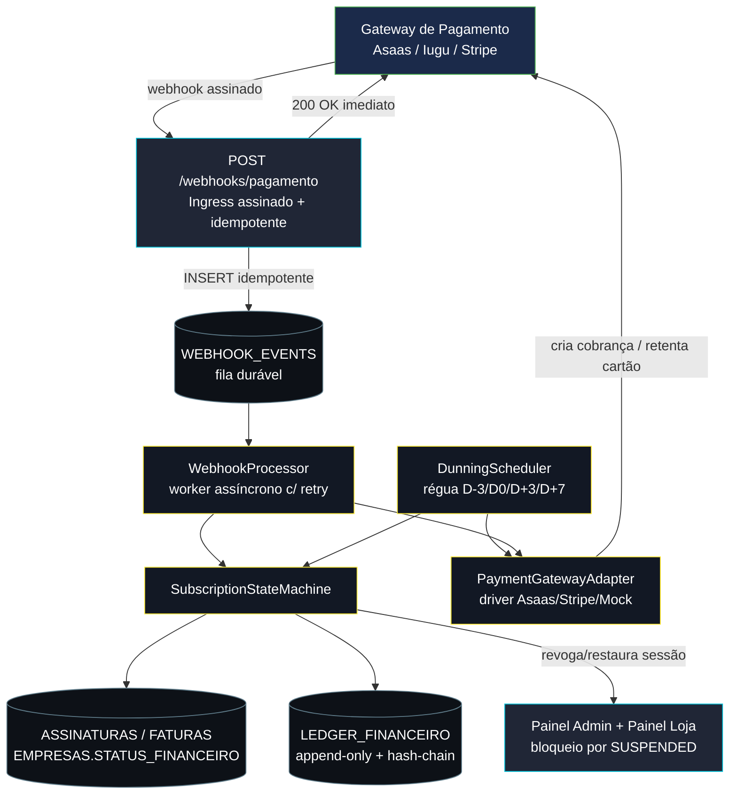
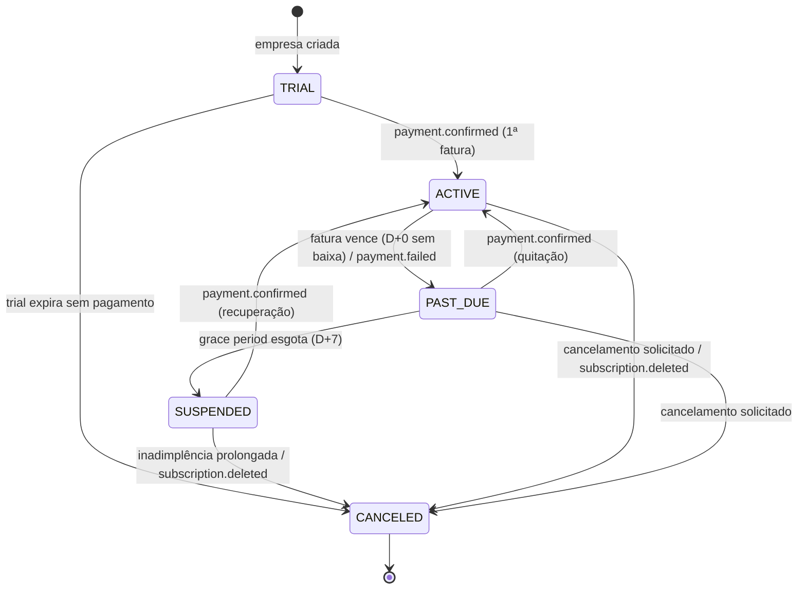

# Motor de Cobrança Recorrente (Billing Engine) — Arquitetura Técnica

> Plataforma **Distre**. Documento de arquitetura do módulo de assinaturas/mensalidades das lojas-clientes.
> Stack-alvo: Node.js + TypeScript + Express + `mssql/msnodesqlv8` (SQL Server Express). Compatível com o que já existe em
> [`financeiroService.ts`](../src/financeiroService.ts) e [`database.ts`](../src/database.ts).

---

## 0. Princípios de design

| Princípio | Como aplicamos |
|---|---|
| **Idempotência ponta-a-ponta** | Todo evento de gateway carrega um ID único; processamento é "exactly-once" via constraint + dedupe. |
| **Append-only para dinheiro** | Nenhum saldo é "editado". Toda mudança financeira é um lançamento novo no `LEDGER_FINANCEIRO` (com hash-chain anti-adulteração). |
| **Source of truth = gateway** | O estado da assinatura/fatura é reconciliado pelos webhooks do gateway, não inferido só por cron. A cron é rede de segurança, não a verdade. |
| **Gateway plugável** | Toda chamada externa passa por `PaymentGatewayAdapter`. Trocar Asaas→Stripe = trocar 1 driver. |
| **Falhar fechado, recuperar sozinho** | Webhook responde `2xx` rápido e enfileira; o processamento real é assíncrono com retry/backoff e DLQ — o mesmo padrão que vocês já usam no [`integrator.ts`](../src/integrator.ts) do egress de entregas. |
| **Concorrência segura** | Transições de estado usam transação SQL + `UPDLOCK`/`HOLDLOCK` para evitar dupla-baixa em corrida. |

---

## 1. Visão de arquitetura



Fluxo nominal de uma mensalidade:

1. `DunningScheduler` (ou o ciclo de renovação) chama `adapter.criarCobranca(...)` → gera fatura no gateway (Pix/Boleto/Cartão).
2. Cliente paga → gateway dispara `payment.confirmed` → `POST /webhooks/pagamento`.
3. Ingress valida assinatura HMAC, **grava o evento bruto** em `WEBHOOK_EVENTS` (dedupe por `GATEWAY_EVENT_ID`) e responde `200` na hora.
4. `WebhookProcessor` consome o evento, abre transação, dá baixa na `FATURA`, registra no `LEDGER_FINANCEIRO` e pede à `SubscriptionStateMachine` a transição `PAST_DUE→ACTIVE`.
5. State machine restaura `EMPRESAS.STATUS_FINANCEIRO=REGULAR` e libera o painel.

---

## 2. Máquina de Estados de Assinatura

### 2.1. Estados canônicos

| Estado (canônico) | Mapa p/ schema atual (`ASSINATURAS_EMPRESAS.STATUS`) | Significado | Painel da loja |
|---|---|---|---|
| `TRIAL` | `TRIAL` | Período de avaliação, sem cobrança ainda. | Liberado |
| `ACTIVE` | `ATIVA` | Em dia. Fatura do ciclo paga. | Liberado |
| `PAST_DUE` | `ATRASADA` | Fatura venceu e não foi paga (dentro do grace period). | Liberado **com banner de aviso** |
| `SUSPENDED` | `SUSPENSA` | Grace period esgotado (D+7). Funções críticas bloqueadas. | **Bloqueado** (read-only) |
| `CANCELED` | `CANCELADA` | Encerrada (cliente pediu, ou churn por inadimplência prolongada). | Bloqueado / logout |

> `EMPRESAS.STATUS_FINANCEIRO` passa a ser **derivado** da assinatura: `ACTIVE/TRIAL→REGULAR`, `PAST_DUE→INADIMPLENTE`, `SUSPENDED→SUSPENSO`, `CANCELED→CANCELADO`. A assinatura é a fonte da verdade; o campo na empresa é só cache para o gate de login/socket que já existe.

### 2.2. Diagrama de transições



### 2.3. Tabela de transições (guardas + efeitos colaterais)

Cada transição é **atômica** (transação SQL) e dispara: (a) update da assinatura, (b) sincronização de `EMPRESAS.STATUS_FINANCEIRO`, (c) lançamento no ledger, (d) efeito de sessão (revogar/restaurar acesso ao painel).

| Evento | De → Para | Guarda | Efeito |
|---|---|---|---|
| `payment.confirmed` | TRIAL/PAST_DUE/SUSPENDED → ACTIVE | fatura existe e não está `PAGA` | baixa fatura, ledger `CREDITO_PAGAMENTO`, libera painel, agenda próximo ciclo |
| `payment.failed` / `payment.overdue` | ACTIVE → PAST_DUE | fatura vencida | ledger `MARCA_ATRASO`, inicia régua de dunning |
| (cron D+7) | PAST_DUE → SUSPENDED | dias_atraso > `DIAS_CARENCIA_BLOQUEIO` | revoga sessões da loja, bloqueia painel |
| `payment.refunded` / `chargeback` | ACTIVE → PAST_DUE | — | ledger `ESTORNO`, reabre fatura |
| `subscription.deleted` | qualquer → CANCELED | — | ledger `CANCELAMENTO`, logout, `delivery`-stop opcional |
| `subscription.created` | [*] → TRIAL/ACTIVE | — | cria assinatura local + ledger `ABERTURA` |

Transições **inválidas** (ex.: `CANCELED → ACTIVE` direto) são rejeitadas pela state machine e logadas no ledger como `TRANSICAO_REJEITADA` — nunca silenciosamente ignoradas.

---

## 3. Schema SQL atualizado

DDL idempotente no mesmo estilo `IF NOT EXISTS ... CREATE TABLE` de [`database.ts`](../src/database.ts). Adicione ao `inicializarBanco()`.

### 3.1. Alterações em tabelas existentes

```sql
-- Amplia o domínio de STATUS da assinatura (TRIAL/ACTIVE/PAST_DUE/SUSPENDED/CANCELED)
-- Mantém compatibilidade: 'ATIVA'->'ACTIVE', 'CANCELADA'->'CANCELED' migrados em data-fix.
IF NOT EXISTS (SELECT * FROM sys.columns WHERE object_id=OBJECT_ID('ASSINATURAS_EMPRESAS') AND name='TRIAL_EXPIRA_EM')
  ALTER TABLE ASSINATURAS_EMPRESAS ADD TRIAL_EXPIRA_EM VARCHAR(100) NULL;
IF NOT EXISTS (SELECT * FROM sys.columns WHERE object_id=OBJECT_ID('ASSINATURAS_EMPRESAS') AND name='GATEWAY_SUBSCRIPTION_ID')
  ALTER TABLE ASSINATURAS_EMPRESAS ADD GATEWAY_SUBSCRIPTION_ID VARCHAR(200) NULL;
IF NOT EXISTS (SELECT * FROM sys.columns WHERE object_id=OBJECT_ID('ASSINATURAS_EMPRESAS') AND name='METODO_PAGAMENTO_PADRAO')
  ALTER TABLE ASSINATURAS_EMPRESAS ADD METODO_PAGAMENTO_PADRAO VARCHAR(20) NULL; -- PIX | BOLETO | CARTAO
IF NOT EXISTS (SELECT * FROM sys.columns WHERE object_id=OBJECT_ID('ASSINATURAS_EMPRESAS') AND name='SUSPENSA_EM')
  ALTER TABLE ASSINATURAS_EMPRESAS ADD SUSPENSA_EM VARCHAR(100) NULL;

-- Faturas: rastrear método e tentativas de dunning
IF NOT EXISTS (SELECT * FROM sys.columns WHERE object_id=OBJECT_ID('FATURAS') AND name='METODO_PAGAMENTO')
  ALTER TABLE FATURAS ADD METODO_PAGAMENTO VARCHAR(20) NULL;          -- PIX | BOLETO | CARTAO
IF NOT EXISTS (SELECT * FROM sys.columns WHERE object_id=OBJECT_ID('FATURAS') AND name='TENTATIVAS_COBRANCA')
  ALTER TABLE FATURAS ADD TENTATIVAS_COBRANCA INT NOT NULL DEFAULT 0;
IF NOT EXISTS (SELECT * FROM sys.columns WHERE object_id=OBJECT_ID('FATURAS') AND name='PROXIMA_ACAO_DUNNING')
  ALTER TABLE FATURAS ADD PROXIMA_ACAO_DUNNING VARCHAR(100) NULL;     -- timestamp da próxima régua
```

### 3.2. `WEBHOOK_EVENTS` — fila durável + idempotência

```sql
IF NOT EXISTS (SELECT * FROM sysobjects WHERE name='WEBHOOK_EVENTS' AND xtype='U')
CREATE TABLE WEBHOOK_EVENTS (
  ID                 VARCHAR(50)   PRIMARY KEY,              -- uuid interno
  GATEWAY_EVENT_ID   VARCHAR(200)  NOT NULL,                 -- id do evento no provedor
  GATEWAY            VARCHAR(30)   NOT NULL,                 -- ASAAS | STRIPE | IUGU | MOCK
  EVENT_TYPE         VARCHAR(80)   NOT NULL,                 -- payment.confirmed, etc.
  PAYLOAD            NVARCHAR(MAX) NOT NULL,                 -- corpo bruto recebido (auditoria)
  ASSINATURA_HMAC    VARCHAR(300)  NULL,                     -- assinatura recebida no header
  STATUS             VARCHAR(20)   NOT NULL DEFAULT 'PENDENTE', -- PENDENTE|PROCESSADO|FALHA|DLQ
  TENTATIVAS         INT           NOT NULL DEFAULT 0,
  PROXIMA_TENTATIVA  VARCHAR(100)  NULL,
  ERRO_ULTIMO        NVARCHAR(MAX) NULL,
  RECEBIDO_EM        VARCHAR(100)  NOT NULL,
  PROCESSADO_EM      VARCHAR(100)  NULL,
  -- A constraint UNIQUE é o coração da idempotência: o mesmo evento nunca entra 2x.
  CONSTRAINT UQ_WEBHOOK_EVENT UNIQUE (GATEWAY, GATEWAY_EVENT_ID)
);
CREATE INDEX IX_WEBHOOK_STATUS ON WEBHOOK_EVENTS (STATUS, PROXIMA_TENTATIVA);
```

### 3.3. `LEDGER_FINANCEIRO` — append-only com hash-chain

```sql
IF NOT EXISTS (SELECT * FROM sysobjects WHERE name='LEDGER_FINANCEIRO' AND xtype='U')
CREATE TABLE LEDGER_FINANCEIRO (
  SEQ            BIGINT IDENTITY(1,1) PRIMARY KEY,           -- ordem imutável append-only
  ID             VARCHAR(50)   NOT NULL UNIQUE,
  EMPRESA_ID     VARCHAR(50)   NOT NULL,
  ASSINATURA_ID  VARCHAR(50)   NULL,
  FATURA_ID      VARCHAR(50)   NULL,
  TIPO_LANCAMENTO VARCHAR(40)  NOT NULL,  -- ABERTURA|CREDITO_PAGAMENTO|MARCA_ATRASO|ESTORNO|CANCELAMENTO|SUSPENSAO|AJUSTE
  VALOR          DECIMAL(14,2) NOT NULL,  -- positivo=crédito p/ plataforma, negativo=estorno
  MOEDA          VARCHAR(3)    NOT NULL DEFAULT 'BRL',
  ORIGEM         VARCHAR(40)   NOT NULL,  -- WEBHOOK|MANUAL_ADMIN|DUNNING|SYSTEM
  REFERENCIA_EXTERNA VARCHAR(200) NULL,   -- gateway transaction id
  METADADOS      NVARCHAR(MAX) NULL,      -- snapshot JSON do contexto
  HASH_ANTERIOR  CHAR(64)      NULL,      -- hash do registro anterior (cadeia)
  HASH_ATUAL     CHAR(64)      NOT NULL,  -- sha256(campos + HASH_ANTERIOR)
  CRIADO_EM      VARCHAR(100)  NOT NULL,
  CRIADO_POR     VARCHAR(100)  NOT NULL   -- token admin ou 'SYSTEM'
);
GO
-- Imutabilidade reforçada no banco: bloqueia UPDATE e DELETE no ledger.
IF OBJECT_ID('TRG_LEDGER_IMUTAVEL','TR') IS NOT NULL DROP TRIGGER TRG_LEDGER_IMUTAVEL;
GO
CREATE TRIGGER TRG_LEDGER_IMUTAVEL ON LEDGER_FINANCEIRO
INSTEAD OF UPDATE, DELETE AS
BEGIN
  RAISERROR('LEDGER_FINANCEIRO e append-only: UPDATE/DELETE proibido.', 16, 1);
  ROLLBACK TRANSACTION;
END;
```

> **Hash-chain:** cada lançamento guarda `HASH_ATUAL = sha256(ID|EMPRESA_ID|TIPO|VALOR|REFERENCIA|CRIADO_EM|HASH_ANTERIOR)`. Auditoria detecta adulteração recomputando a cadeia: se um registro antigo for forçado no banco, todos os hashes seguintes deixam de bater. Combinado com o trigger, dá garantia forte de integridade sem depender de feature paga (Ledger/Temporal Tables do SQL Server Enterprise).

---

## 4. Adapter Pattern — abstração do gateway

`backend/src/billing/PaymentGatewayAdapter.ts`

```typescript
export type MetodoPagamento = 'PIX' | 'BOLETO' | 'CARTAO';

export interface CobrancaInput {
  empresaId: string;
  faturaId: string;
  valor: number;
  vencimento: string;        // ISO
  metodo: MetodoPagamento;
  descricao: string;
  clienteGatewayId?: string; // id do cliente no provedor (se já existir)
}

export interface CobrancaResult {
  gatewayFaturaId: string;
  boletoUrl?: string;
  pixCopiaCola?: string;
  linkPagamento?: string;
  status: 'PENDENTE' | 'CONFIRMADO';
}

export interface WebhookNormalizado {
  gatewayEventId: string;
  eventType: 'payment.confirmed' | 'payment.failed' | 'payment.overdue'
           | 'payment.refunded' | 'subscription.created' | 'subscription.deleted';
  gatewayFaturaId?: string;
  gatewaySubscriptionId?: string;
  valor?: number;
  pagoEm?: string;
  raw: unknown;
}

/**
 * Contrato único de gateway. Regra de negócio (state machine, dunning, ledger)
 * NUNCA importa Asaas/Stripe direto — só esta interface.
 */
export interface PaymentGatewayAdapter {
  readonly nome: 'ASAAS' | 'STRIPE' | 'IUGU' | 'MOCK';

  criarCobranca(input: CobrancaInput): Promise<CobrancaResult>;
  cancelarCobranca(gatewayFaturaId: string): Promise<void>;
  reprocessarCartao(gatewayFaturaId: string): Promise<CobrancaResult>; // retry de cartão (dunning)

  /** Valida a assinatura HMAC do webhook (anti-spoofing). */
  validarAssinatura(rawBody: string, headers: Record<string, string>): boolean;

  /** Traduz o payload específico do provedor para o formato canônico interno. */
  normalizarWebhook(rawBody: string): WebhookNormalizado;
}
```

`backend/src/billing/adapters/AsaasAdapter.ts`, `StripeAdapter.ts`, `MockAdapter.ts` implementam o contrato. Seleção por env:

```typescript
// backend/src/billing/gatewayFactory.ts
export function getGateway(): PaymentGatewayAdapter {
  switch ((process.env.PAYMENT_GATEWAY || 'MOCK').toUpperCase()) {
    case 'ASAAS':  return new AsaasAdapter(process.env.ASAAS_API_KEY!);
    case 'STRIPE': return new StripeAdapter(process.env.STRIPE_SECRET!);
    default:       return new MockAdapter(); // dev/seed — mantém o comportamento atual
  }
}
```

Trocar de provedor = mudar `PAYMENT_GATEWAY`. Nenhuma rota/serviço de negócio muda.

---

## 5. Webhooks resilientes + idempotência

### 5.1. Ingress (responde rápido, processa depois)

`backend/src/billing/webhookRoutes.ts`

```typescript
import { Router, Request, Response } from 'express';
import crypto from 'crypto';
import mssql from 'mssql/msnodesqlv8';
import { pool } from '../database';
import { getGateway } from './gatewayFactory';

const router = Router();

// IMPORTANTE: precisa do corpo BRUTO para validar HMAC.
// Em index.ts, registre esta rota com express.raw ANTES do express.json global:
//   app.use('/api/billing/webhooks', express.raw({ type: '*/*' }), webhookRoutes);
router.post('/pagamento', async (req: Request, res: Response) => {
  const gateway = getGateway();
  const rawBody = req.body.toString('utf8');

  // 1. Anti-spoofing: rejeita o que não vier assinado pelo provedor.
  if (!gateway.validarAssinatura(rawBody, req.headers as Record<string, string>)) {
    return res.status(401).json({ error: 'assinatura invalida' });
  }

  // 2. Normaliza e GRAVA antes de processar (durabilidade). Responde 200 rápido.
  const evt = gateway.normalizarWebhook(rawBody);
  try {
    await pool.request()
      .input('id', mssql.VarChar, crypto.randomUUID())
      .input('gwEvt', mssql.VarChar, evt.gatewayEventId)
      .input('gw', mssql.VarChar, gateway.nome)
      .input('type', mssql.VarChar, evt.eventType)
      .input('payload', mssql.NVarChar, rawBody)
      .input('hmac', mssql.VarChar, req.headers['x-signature'] as string || null)
      .input('rec', mssql.VarChar, new Date().toISOString())
      .query(`INSERT INTO WEBHOOK_EVENTS
              (ID, GATEWAY_EVENT_ID, GATEWAY, EVENT_TYPE, PAYLOAD, ASSINATURA_HMAC, STATUS, RECEBIDO_EM)
              VALUES (@id, @gwEvt, @gw, @type, @payload, @hmac, 'PENDENTE', @rec)`);
  } catch (err: any) {
    // Violação de UNIQUE (2627/2601) = evento repetido. Idempotência: aceita e ignora.
    if (err.number === 2627 || err.number === 2601) {
      return res.status(200).json({ duplicado: true });
    }
    // Falha real de banco: devolve 5xx para o gateway RETENTAR (não perdemos o evento).
    return res.status(503).json({ error: 'indisponivel, retentar' });
  }

  // 3. Dispara o worker (não bloqueia a resposta).
  setImmediate(() => processarFilaWebhooks().catch(console.error));
  return res.status(200).json({ recebido: true });
});

export default router;
```

### 5.2. Worker com retry/backoff + DLQ

Reaproveita exatamente a filosofia do seu [`integrator.ts`](../src/integrator.ts) (Exponential Backoff + DLQ), mas para eventos **de entrada**:

```typescript
// backend/src/billing/webhookProcessor.ts
const BACKOFF_SEGUNDOS = [0, 5, 25, 120, 600]; // tentativas 1..5

export async function processarFilaWebhooks() {
  const agora = new Date().toISOString();
  const pend = await pool.request()
    .input('agora', mssql.VarChar, agora)
    .query(`SELECT TOP 20 * FROM WEBHOOK_EVENTS
            WHERE STATUS='PENDENTE' AND (PROXIMA_TENTATIVA IS NULL OR PROXIMA_TENTATIVA <= @agora)
            ORDER BY RECEBIDO_EM ASC`);

  for (const evt of pend.recordset) {
    try {
      await processarEvento(evt);   // abre transação, aplica state machine + ledger
      await marcarProcessado(evt.ID);
    } catch (err: any) {
      const tentativa = evt.TENTATIVAS + 1;
      if (tentativa >= BACKOFF_SEGUNDOS.length) {
        await moverParaDLQ(evt.ID, err.message);   // STATUS='DLQ' — alerta no painel admin
      } else {
        const proxima = new Date(Date.now() + BACKOFF_SEGUNDOS[tentativa] * 1000).toISOString();
        await reagendar(evt.ID, tentativa, proxima, err.message);
      }
    }
  }
}

// Rede de segurança: varre a fila periodicamente caso o setImmediate tenha morrido.
export function iniciarWorkerWebhooks() {
  setInterval(() => processarFilaWebhooks().catch(console.error), 30_000);
}
```

`processarEvento` é onde a **idempotência de negócio** se completa: antes de aplicar, checa se a fatura já está `PAGA` (no-op se sim). Assim, mesmo que o worker rode 2x o mesmo evento por corrida, o efeito é único.

---

## 6. Régua de cobrança / Smart Dunning

Substitui a `rotinaVerificacaoInadimplencia` atual por um agendador de régua. Roda 1x/dia (idealmente) e é **idempotente por dia** (campo `PROXIMA_ACAO_DUNNING` evita reenvio duplicado).

```typescript
// backend/src/billing/dunningScheduler.ts
export async function executarReguaCobranca() {
  const gateway = getGateway();
  const hoje = new Date();

  const faturas = await buscarFaturasAbertasComDiasAteVencimento(); // calcula D-x/D+x por fatura

  for (const f of faturas) {
    switch (f.diasAteVencimento) {
      case 3:   // D-3: lembrete preventivo
        await garantirCobrancaGerada(gateway, f);   // cria Pix/Boleto se ainda não existe
        await notificar(f, 'LEMBRETE_D3');           // e-mail/WhatsApp (usa whatsapp.ts)
        break;
      case 0:   // D-0: alerta do dia
        await notificar(f, 'VENCE_HOJE');
        break;
      case -3:  // D+3: 1ª retentativa de cartão + alerta de atraso
        await stateMachine.transicionar(f.assinaturaId, 'payment.overdue'); // ACTIVE->PAST_DUE
        if (f.metodo === 'CARTAO') await gateway.reprocessarCartao(f.gatewayFaturaId);
        await notificar(f, 'ATRASO_D3');
        break;
      case -7:  // D+7: suspende e bloqueia painel (grace period esgotado)
        await stateMachine.transicionar(f.assinaturaId, 'SUSPENDER');       // PAST_DUE->SUSPENDED
        await notificar(f, 'SUSPENSAO');
        break;
    }
  }
}
```

**Bloqueio do painel (grace period):** a suspensão já se integra ao que existe hoje — `SubscriptionStateMachine` ao entrar em `SUSPENDED` seta `EMPRESAS.STATUS_FINANCEIRO='SUSPENSO'` e **revoga as sessões** das lojas da empresa exatamente como a rotina atual faz em [`financeiroService.ts:93-104`](../src/financeiroService.ts). Para bloquear funções críticas em runtime (não só no login), adicione um middleware:

```typescript
// bloqueia ações de escrita (criar entrega/despachar) para empresa suspensa
export function exigirEmpresaAdimplente(req, res, next) {
  const sessao = obterSessaoDoRequest(req);
  const loja = lojas.find(l => l.id === sessao?.lojaId);
  const emp = empresas.find(e => e.id === loja?.empresaId);
  if (emp?.statusFinanceiro === 'SUSPENSO' || emp?.statusFinanceiro === 'CANCELADO') {
    return res.status(402).json({ error: 'Assinatura suspensa por inadimplência.', codigo: 'PAYMENT_REQUIRED' });
  }
  next();
}
```
Aplicar nas rotas de mutação de entregas no [`gateway.ts`](../src/gateway.ts) — leitura continua liberada (read-only), escrita bloqueada.

---

## 7. Esqueleto de arquivos (organização)

```
backend/src/billing/
├── PaymentGatewayAdapter.ts     # interface + tipos canônicos
├── gatewayFactory.ts            # seleção por env
├── adapters/
│   ├── AsaasAdapter.ts
│   ├── StripeAdapter.ts
│   └── MockAdapter.ts           # mantém o mock atual p/ dev/seed
├── SubscriptionStateMachine.ts  # transições + guardas + efeitos (transacional)
├── ledgerService.ts             # appendLedger() com hash-chain (única porta de escrita)
├── webhookRoutes.ts             # ingress assinado + idempotente
├── webhookProcessor.ts          # worker retry/backoff + DLQ
└── dunningScheduler.ts          # régua D-3/D0/D+3/D+7
```

`ledgerService.ts` — a única forma de escrever no ledger (garante o hash-chain):

```typescript
export async function appendLedger(tx: mssql.Transaction, l: LancamentoInput) {
  const anterior = await ultimoHash(tx);                 // SELECT TOP 1 ... ORDER BY SEQ DESC (UPDLOCK)
  const id = crypto.randomUUID();
  const criadoEm = new Date().toISOString();
  const hashAtual = crypto.createHash('sha256')
    .update([id, l.empresaId, l.tipo, l.valor, l.referenciaExterna ?? '', criadoEm, anterior ?? ''].join('|'))
    .digest('hex');
  await tx.request()
    .input('id', mssql.VarChar, id)
    .input('emp', mssql.VarChar, l.empresaId)
    .input('tipo', mssql.VarChar, l.tipo)
    .input('valor', mssql.Decimal(14,2), l.valor)
    .input('origem', mssql.VarChar, l.origem)
    .input('ref', mssql.VarChar, l.referenciaExterna ?? null)
    .input('meta', mssql.NVarChar, JSON.stringify(l.metadados ?? {}))
    .input('hAnt', mssql.Char, anterior)
    .input('hAtu', mssql.Char, hashAtual)
    .input('criado', mssql.VarChar, criadoEm)
    .input('por', mssql.VarChar, l.criadoPor ?? 'SYSTEM')
    .query(`INSERT INTO LEDGER_FINANCEIRO
            (ID,EMPRESA_ID,TIPO_LANCAMENTO,VALOR,ORIGEM,REFERENCIA_EXTERNA,METADADOS,HASH_ANTERIOR,HASH_ATUAL,CRIADO_EM,CRIADO_POR)
            VALUES (@id,@emp,@tipo,@valor,@origem,@ref,@meta,@hAnt,@hAtu,@criado,@por)`);
}
```

`SubscriptionStateMachine.transicionar` — núcleo transacional e idempotente:

```typescript
const TRANSICOES: Record<string, Record<string, string>> = {
  TRIAL:     { 'payment.confirmed':'ACTIVE', 'trial.expired':'CANCELED' },
  ACTIVE:    { 'payment.overdue':'PAST_DUE', 'subscription.deleted':'CANCELED' },
  PAST_DUE:  { 'payment.confirmed':'ACTIVE', 'SUSPENDER':'SUSPENDED', 'subscription.deleted':'CANCELED' },
  SUSPENDED: { 'payment.confirmed':'ACTIVE', 'subscription.deleted':'CANCELED' },
  CANCELED:  {},
};

export async function transicionar(assinaturaId: string, evento: string) {
  const tx = new mssql.Transaction(pool);
  await tx.begin();
  try {
    // UPDLOCK/HOLDLOCK: serializa transições concorrentes da MESMA assinatura.
    const r = await tx.request().input('id', mssql.VarChar, assinaturaId)
      .query('SELECT * FROM ASSINATURAS_EMPRESAS WITH (UPDLOCK, HOLDLOCK) WHERE ID=@id');
    const sub = r.recordset[0];
    const destino = TRANSICOES[sub.STATUS]?.[evento];

    if (!destino) {                       // transição inválida → audita, não explode
      await appendLedger(tx, { empresaId: sub.EMPRESA_ID, tipo: 'TRANSICAO_REJEITADA',
                               valor: 0, origem: 'SYSTEM', metadados: { de: sub.STATUS, evento } });
      await tx.commit();
      return { ok: false, motivo: 'transicao_invalida' };
    }
    if (destino === sub.STATUS) { await tx.commit(); return { ok: true, noop: true }; } // idempotente

    await tx.request().input('id', mssql.VarChar, assinaturaId)
      .input('s', mssql.VarChar, destino).query('UPDATE ASSINATURAS_EMPRESAS SET STATUS=@s WHERE ID=@id');
    await sincronizarStatusEmpresa(tx, sub.EMPRESA_ID, destino);  // deriva STATUS_FINANCEIRO
    await appendLedger(tx, { empresaId: sub.EMPRESA_ID, assinaturaId, tipo: 'TRANSICAO',
                             valor: 0, origem: 'SYSTEM', metadados: { de: sub.STATUS, para: destino, evento } });
    await tx.commit();

    if (destino === 'SUSPENDED' || destino === 'CANCELED') revogarSessoesDaEmpresa(sub.EMPRESA_ID);
    return { ok: true, de: sub.STATUS, para: destino };
  } catch (e) {
    await tx.rollback();
    throw e;
  }
}
```

---

## 8. Concorrência, segurança e falha-zero (checklist)

| Risco | Mitigação |
|---|---|
| Dupla baixa de fatura (webhook + baixa manual no mesmo instante) | Transação + `WITH (UPDLOCK, HOLDLOCK)` na fatura; checagem `STATUS<>'PAGA'` dentro da transação. |
| Evento de webhook processado 2x | `UNIQUE(GATEWAY, GATEWAY_EVENT_ID)` no ingress + no-op idempotente no `processarEvento`. |
| Webhook forjado | `validarAssinatura` HMAC obrigatória por adapter; rejeita `401` sem assinatura válida. |
| Backend offline quando gateway dispara | Ingress só responde `200` após `INSERT`; em falha de banco responde `503` → gateway retenta. Worker tem DLQ. |
| Adulteração do histórico financeiro | `LEDGER_FINANCEIRO` append-only (trigger anti-UPDATE/DELETE) + hash-chain verificável. |
| Acoplamento a 1 provedor | Toda integração atrás de `PaymentGatewayAdapter`; troca por env var. |
| Loja suspensa continua operando | `exigirEmpresaAdimplente` nas rotas de escrita + revogação de sessão na suspensão. |
| Segredos no código | `ASAAS_API_KEY`/`STRIPE_SECRET`/`PAYMENT_GATEWAY` via env (nunca commitados). |

---

## 9. Roadmap de migração incremental (sem big-bang)

1. **Fase 0 — Schema:** adicionar tabelas `WEBHOOK_EVENTS`, `LEDGER_FINANCEIRO` e colunas novas no `inicializarBanco()`. Migrar `ATIVA→ACTIVE`, `CANCELADA→CANCELED` num data-fix. *(Não quebra nada — só amplia.)*
2. **Fase 1 — Adapter + Mock:** criar `billing/` com `MockAdapter` reproduzindo o comportamento atual de boleto/pix fake. Refatorar `cobrar-manual` para usar o adapter.
3. **Fase 2 — Ledger:** todo ponto que hoje escreve em `HISTORICO_PAGAMENTOS` passa a também chamar `appendLedger`. (Histórico vira "view operacional", ledger vira "verdade contábil".)
4. **Fase 3 — State machine:** trocar os `UPDATE STATUS` espalhados pela `transicionar()`. A cron atual vira chamada à régua de dunning.
5. **Fase 4 — Webhooks reais:** plugar `AsaasAdapter`/`StripeAdapter`, registrar `webhookRoutes` com `express.raw`, ligar `iniciarWorkerWebhooks()` no `startServer()`.
6. **Fase 5 — Dunning + bloqueio:** ativar `executarReguaCobranca` (1x/dia) e o middleware `exigirEmpresaAdimplente`.

Cada fase é deployável isolada e reversível.
```
